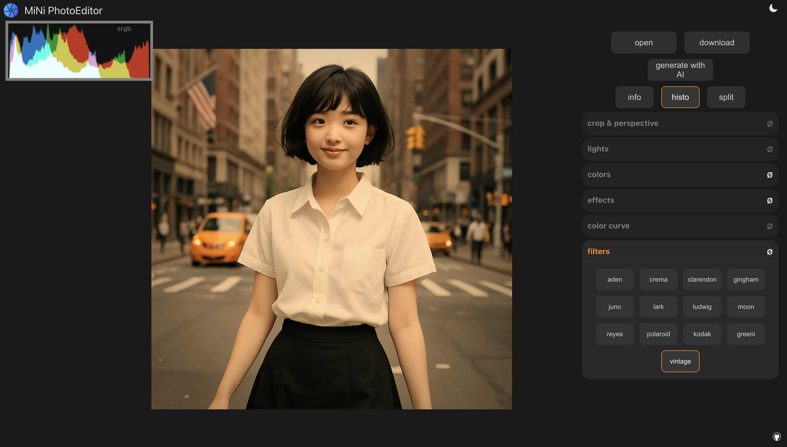

# mini-img-editor (now AI powered 😅)

Online webgl2 photo editor with AI image generation using OpenAI latest `gpt-image-1` model API.

 

Link https://mei.yaps.gg

 

Powered by mini-js (https://github.com/xdadda/minijs) and mini-gl (https://github.com/xdadda/mini-gl) and (https://yaps.gg)
