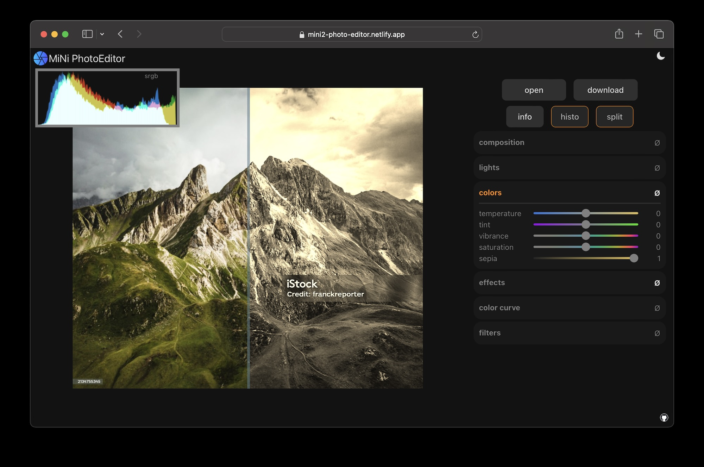

# mini-img-editor

Online webgl2 photo editor  
(https://mini2-photo-editor.netlify.app)  

  

100% privacy! images are edited locally in the browser, no uploads to backend server.

Current features: 
* Crop
* Perspective correction
* Image resize
* Lights and colors adjustments
* Vignette
* Clarity/ sharpening
* Noise reduction
* Color curves
* Insta-like filters
* Image blender
* Bokeh/lens and gaussian blur
* Heal brush (telea inpaint algorithm)
* Split view before-after
* Color histogram
* Exif/Tiff/GPS info
* Display-P3 color space
* sRGB correct workflow (linear sRGB)
  
  
Notes: 
* file formats support depends on the browser/ platform being used (eg HEIC open natively in MacOS Safari, JPEG-XL and AVIF in Safari and Chrome, ...)
* 16-bit images can be opened but shaders and download is currently limited to 8-bit due to webgl limitations

Please leave feature requests in the issues section (ideally showing a real life example) and I'll see what I can do.  
 
 
Powered by [mini-js](https://github.com/xdadda/minijs), [mini-gl](https://github.com/xdadda/mini-gl) and [mini-exif](https://github.com/xdadda/mini-exif)
